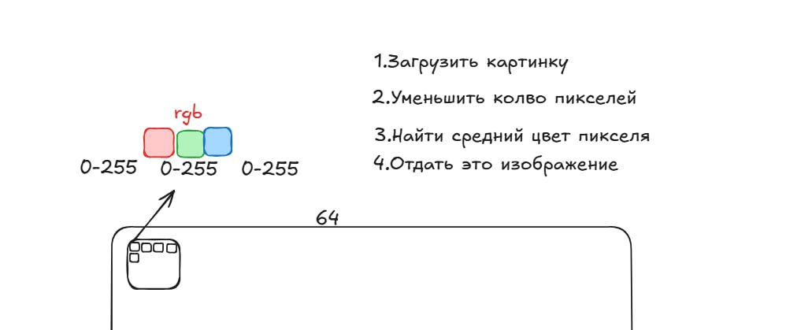

# Pixel Art Converter

A simple Python program that converts regular images into pixel art.

## About the project

The program opens an image, reduces its resolution, limits the number of colors, and saves a new pixel-art version. If no input path is provided, a standard file-selection dialog is displayed.

The whole application is intentionally kept in one main file so that a beginner can follow every step of the algorithm.

## Project goal

The goal was to understand how computers store and transform images and to implement a small graphical filter without using an online converter.

The main questions were:

- What is a digital image made of?
- How are width and height related?
- Why do some resizing methods blur an image?
- How does a limited palette create a pixel-art style?
- How can a script be made convenient for another user?

## Implemented features

- PNG, JPEG, BMP, and WEBP input;
- a graphical file-selection dialog;
- optional file path as a command-line argument;
- configurable output width;
- automatic height calculation that preserves proportions;
- nearest-neighbor resizing;
- configurable color-palette size;
- sharp enlargement for easier viewing;
- PNG export;
- handling of invalid paths and parameters.

## How it works

First, the image is converted to RGB. Each pixel stores three values representing the intensity of red, green, and blue.

The new height is calculated with this formula:

```text
new height = old height / old width × new width
```

The image is reduced using the `NEAREST` algorithm. Unlike smoothing algorithms, it does not blend neighboring pixels, so the edges remain sharp.

Color quantization then replaces all colors with a smaller palette. For example, an image containing thousands of shades can be reduced to 16 colors.

Finally, the small image is enlarged without smoothing and saved as a PNG file.

## What I learned

During this project, I learned how to:

- use the Pillow library;
- open and save image files;
- understand the RGB color model;
- resize images;
- preserve aspect ratio;
- compare resizing algorithms;
- reduce a color palette;
- work with paths using `pathlib`;
- process user input;
- create a file dialog with Tkinter;
- handle errors with `try/except`;
- divide a program into small functions;
- use `if __name__ == "__main__"`.

